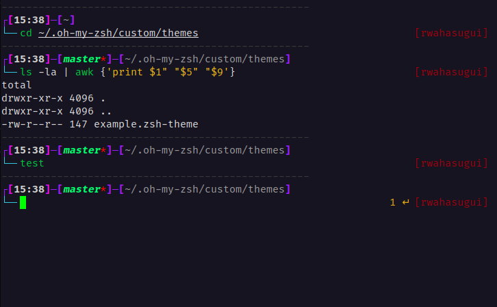

# rwahasugui.zsh-theme

## Preview


## Installation

_For Installation you need git_

### Oh My Zsh

1. Clone the repository:

```shell
git clone https://github.com/rafawhs/rwahasugui.zsh-theme $ZSH/themes/rwahasugui.zsh-theme
```

2. Go to your `~/.zshrc` file and set `ZSH_THEME=rwahasugui`
